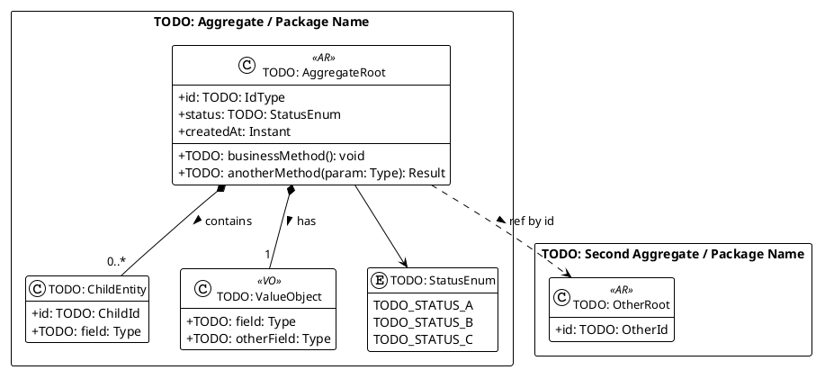
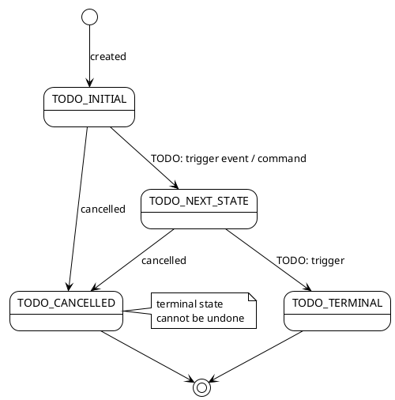

# Domain Model

The domain model shows entities, value objects, aggregates, and their relationships.
It is the authoritative source for class structure in the domain layer.

<!--
For the AI coding assistant:
- Entities have identity (id field). Generate them as classes with equals/hashCode on id only.
- Value objects have no identity. Generate them as immutable records/data classes.
- Aggregate roots are marked <<AR>>. Only access aggregates through their root.
- Relationships show cardinality. A 1-to-many owned collection lives inside the aggregate.
- Use exact class names from this diagram and specs/glossary.md.
-->

## Class Diagram

## Aggregate Boundaries

Aggregates define transactional consistency boundaries.
Never load or modify two aggregates in the same transaction (except via sagas/events).

| Aggregate Root | Owns                              | References by ID only |
| -------------- | --------------------------------- | --------------------- |
| TODO: RootName | TODO: ChildEntity, TODO: ValueObj | TODO: OtherRoot       |

## State Transitions

<!-- Add a state diagram per aggregate that has a lifecycle status. -->

