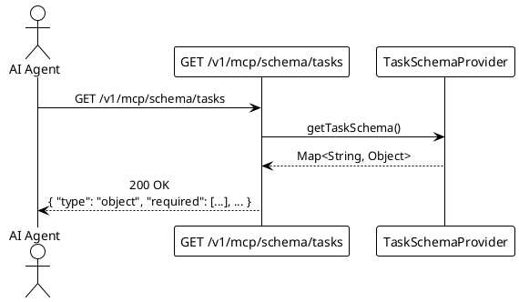

# UC001: Retrieve Task Schema

<!--
For the AI coding assistant:
- The BDD scenarios in specs/features/ are the authoritative behaviour specification.
- Implement exactly what the scenarios describe — no more, no less.
- Use only terms defined in specs/glossary.md.
-->

## Overview

| Property              | Value                                                                                       |
| --------------------- | ------------------------------------------------------------------------------------------- |
| **ID**                | UC001                                                                                       |
| **Level**             | User Goal                                                                                   |
| **Primary Actor**     | AI Agent                                                                                    |
| **Trigger**           | AI Agent needs to understand the Task input structure before constructing insertion payloads |
| **Precondition**      | MCP server is running and healthy                                                           |
| **Success Guarantee** | AI Agent holds a valid JSON Schema document describing the Task input shape                 |
| **Related Rules**     | —                                                                                           |
| **Related Feature**   | [features/UC001-retrieve-task-schema.feature](../features/UC001-retrieve-task-schema.feature) |

## Goal

Allow an AI Agent to discover the exact data contract for Task creation before submitting
any data. The schema response tells the agent which fields are required, which are optional,
and what values are valid for each field — removing the need for the agent to guess or infer
structure.

This use case only returns schema metadata. It does **not** create, modify, or delete any
Task records.

## Main Success Scenario

1. **AI Agent** sends `GET /v1/mcp/schema/tasks`.
2. **System** retrieves the Task input schema from `TaskSchemaProvider`.
3. **System** serialises the schema to JSON.
4. **System** responds with HTTP 200 and the JSON Schema document.
5. **AI Agent** reads the schema and uses it to construct valid Task payloads for UC002.

## Extensions (Alternate Flows)

**4a. Server error during schema serialisation:**

1. System responds with HTTP 500 and error code `INTERNAL_ERROR`.
2. Use case ends in failure.

## Transaction Boundary

Read-only. No database interaction. The schema is produced in memory by `TaskSchemaProvider`
and does not require a transaction.

## Sequence Diagram

## BDD Scenarios

The feature file is the **single source of truth** for behaviour — it is also executed as an
acceptance test. See [features/UC001-retrieve-task-schema.feature](../features/UC001-retrieve-task-schema.feature).

| Scenario ID | Description |
| ----------- | ----------- |
| UC001-S01   | Schema is retrieved with HTTP 200 |
| UC001-S02   | Schema marks `title` and `status` as required, `description` as optional |
| UC001-S03   | Schema restricts `status` to the valid enum values |
