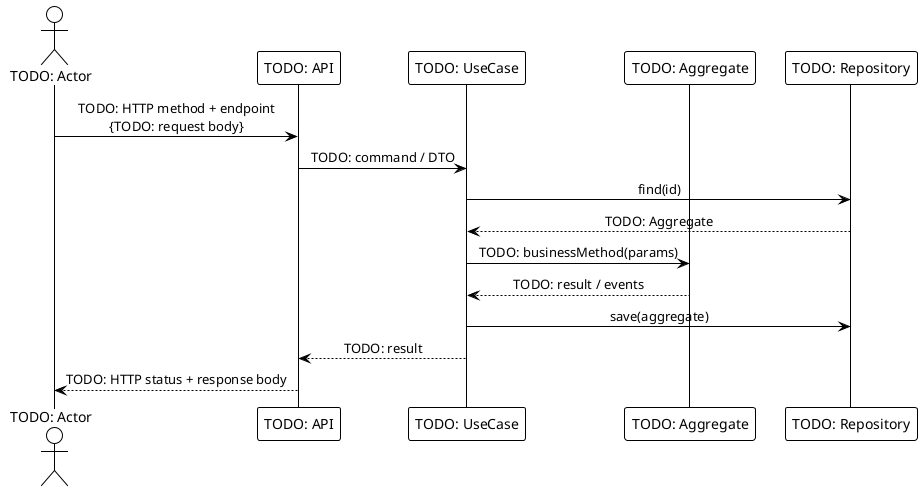

# UC001: \<Use Case Name\>

<!--
For the AI coding assistant:
- The BDD scenarios in specs/features/ are the authoritative behaviour specification.
- Implement exactly what the scenarios describe — no more, no less.
- Reference business rules (BR-NNN) from specs/domain_model/business_rules.md.
- Use only terms defined in specs/glossary.md.

Use Case template based on Cockburn's "Writing Effective Use Cases" (Addison-Wesley, 2000).
Levels: Summary | User Goal | Sub-function
-->

## Overview

| Property              | Value                                                                               |
| --------------------- | ----------------------------------------------------------------------------------- |
| **ID**                | UC001                                                                               |
| **Level**             | User Goal                                                                           |
| **Primary Actor**     | TODO: Who triggers this use case (use glossary term)                                |
| **Trigger**           | TODO: Event or user action that starts this use case                                |
| **Precondition**      | TODO: What must be true before this use case can run                                |
| **Success Guarantee** | TODO: What is true after successful completion                                      |
| **Related Rules**     | TODO: BR-001, BR-002                                                                |
| **Related Feature**   | [features/UC001-sample_use_case.feature](../features/UC001-sample_use_case.feature) |

## Goal

TODO: 2–3 sentences explaining the purpose and business value.
What problem does this use case solve?
What does it explicitly **NOT** do (scope boundary)?

## Main Success Scenario

<!-- Number each step. Actor steps start with the actor name. System steps start with "System". -->

1. **TODO: Actor** initiates TODO: action (e.g., submits a form, sends a request).
2. **System** validates the input against TODO: rules (BR-001).
3. **System** performs TODO: core domain operation.
4. **System** persists the result.
5. **System** responds with TODO: confirmation / result.

## Extensions (Alternate Flows)

<!-- Document every deviation from the happy path. Reference the step number it branches from. -->

**2a. Validation fails (invalid input):**

1. System rejects the request with error code `TODO_VALIDATION_ERROR`.
2. Use case ends in failure.

**3a. Business rule BR-001 violated:**

1. System rejects the request with error code `TODO_BR001_ERROR_CODE`.
2. Use case ends in failure.

## Transaction Boundary

TODO: Describe the transaction scope.

Example: _Single DB transaction covering load → mutate → save of the `TODO: Aggregate`.
No distributed transaction required._

For distributed transactions (e.g., Temporal workflows), describe the saga/compensation strategy here.

## Sequence Diagram

<!-- Shows the interaction between actor, application layer, domain, and infrastructure.
     Keep it at the application-flow level — not a code walkthrough. -->

## BDD Scenarios

The feature file is the **single source of truth** for behaviour — it is also executed as an
acceptance test. See [features/UC001-sample_use_case.feature](../features/UC001-sample_use_case.feature).
