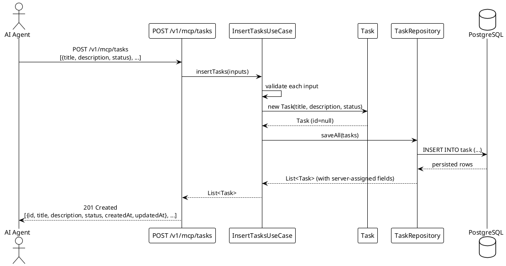

# UC002: Insert Tasks in Bulk

<!--
For the AI coding assistant:
- The BDD scenarios in specs/features/ are the authoritative behaviour specification.
- Implement exactly what the scenarios describe — no more, no less.
- Use only terms defined in specs/glossary.md.
-->

## Overview

| Property              | Value                                                                                                    |
| --------------------- | -------------------------------------------------------------------------------------------------------- |
| **ID**                | UC002                                                                                                    |
| **Level**             | User Goal                                                                                                |
| **Primary Actor**     | AI Agent                                                                                                 |
| **Trigger**           | AI Agent submits a JSON array of Task objects after inspecting the schema (UC001)                        |
| **Precondition**      | MCP server is running and healthy; database is reachable; AI Agent holds a valid schema (UC001)          |
| **Success Guarantee** | All submitted Task records are persisted; server-assigned `id`, `createdAt`, `updatedAt` are returned   |
| **Related Rules**     | —                                                                                                        |
| **Related Feature**   | [features/UC002-insert-tasks-in-bulk.feature](../features/UC002-insert-tasks-in-bulk.feature)            |

## Goal

Allow an AI Agent to persist a batch of Task records in a single request. The server
validates every item in the batch, assigns server-side fields (`id`, `createdAt`,
`updatedAt`), and inserts all items atomically — if any item is invalid the entire batch is
rejected and no records are written.

This use case handles creation only. It does **not** update, delete, or query existing Task
records.

## Main Success Scenario

1. **AI Agent** sends `POST /v1/mcp/tasks` with a JSON array of one or more Task input
   objects, each containing at least `title` and `status`.
2. **System** validates that the array is non-empty and that every item satisfies the Task
   input schema (required fields present, `status` is a known enum value, `title` is not
   blank).
3. **System** begins a single database transaction.
4. **System** creates a `Task` record for each input object, assigning `id`, `createdAt`,
   and `updatedAt`.
5. **System** persists all records via `TaskRepository`.
6. **System** commits the transaction.
7. **System** responds with HTTP 201 and an array of the created `Task` objects (including
   server-assigned fields).

## Extensions (Alternate Flows)

**2a. Array is empty (`[]`):**

1. System rejects the request with HTTP 400 and error code `INVALID_INPUT`.
2. No records are written. Use case ends in failure.

**2b. One or more items have a blank `title`:**

1. System rejects the request with HTTP 400 and error code `INVALID_INPUT`.
2. Error details identify the offending item index and field (e.g. `[3].title`).
3. No records are written. Use case ends in failure.

**2c. One or more items have an unknown `status` value:**

1. System rejects the request with HTTP 422 and error code `VALIDATION_FAILED`.
2. Error details identify the offending item index and field (e.g. `[5].status`).
3. No records are written. Use case ends in failure.

**5a. Database write fails:**

1. System rolls back the transaction.
2. System responds with HTTP 500 and error code `INTERNAL_ERROR`.
3. No records are written. Use case ends in failure.

**1a. Request contains a duplicate `Idempotency-Key` header seen within the last 24 hours:**

1. System returns the original HTTP 201 response without re-inserting any records.
2. Use case ends in success (idempotent replay).

## Transaction Boundary

Single database transaction covering the insert of all Task records in the batch.
All records are written atomically — partial success is not possible.
No distributed transaction is required.

## Sequence Diagram

## BDD Scenarios

The feature file is the **single source of truth** for behaviour — it is also executed as an
acceptance test. See [features/UC002-insert-tasks-in-bulk.feature](../features/UC002-insert-tasks-in-bulk.feature).

| Scenario ID | Description |
| ----------- | ----------- |
| UC002-S01   | Valid batch is inserted and all created tasks are returned |
| UC002-S02   | Task with blank title is rejected with INVALID_INPUT |
| UC002-S03   | Task with unknown status is rejected with VALIDATION_FAILED |
| UC002-S04   | Empty array is rejected with INVALID_INPUT |
| UC002-S05   | Repeated request with the same Idempotency-Key does not create duplicate records |
