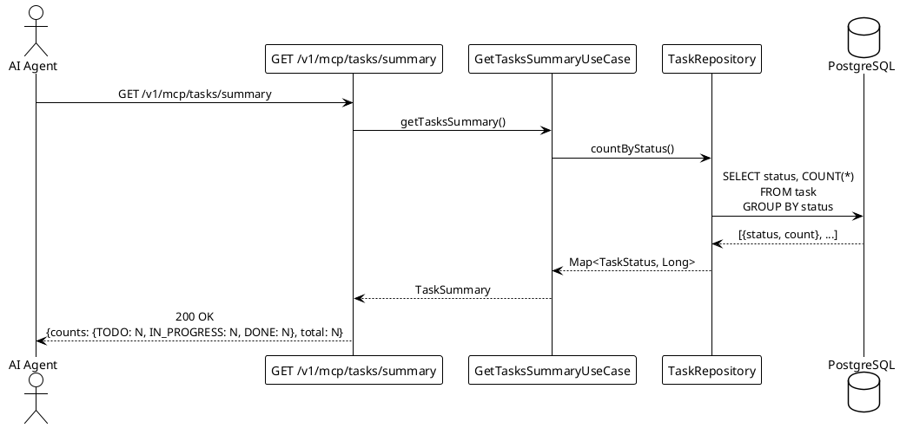

# UC003: Retrieve Task Summary Statistics

<!--
For the AI coding assistant:
- The BDD scenarios in specs/features/ are the authoritative behaviour specification.
- Implement exactly what the scenarios describe — no more, no less.
- Use only terms defined in specs/glossary.md.
-->

## Overview

| Property              | Value                                                                                             |
| --------------------- | ------------------------------------------------------------------------------------------------- |
| **ID**                | UC003                                                                                             |
| **Level**             | User Goal                                                                                         |
| **Primary Actor**     | AI Agent                                                                                          |
| **Trigger**           | AI Agent calls the summary tool to validate the outcome of a prior bulk insertion (UC002)         |
| **Precondition**      | MCP server is running and healthy; database is reachable                                          |
| **Success Guarantee** | AI Agent receives per-status task counts and a total that accurately reflects the database state  |
| **Related Rules**     | —                                                                                                 |
| **Related Feature**   | [features/UC003-retrieve-task-summary.feature](../features/UC003-retrieve-task-summary.feature)  |

## Goal

Allow an AI Agent to verify that a bulk insertion produced the expected distribution of Task
records across statuses. The summary returns the count of tasks for each status value and the
overall total, enabling the agent to confirm that, for example, 1000 tasks with varying
statuses were persisted correctly.

This use case is read-only. It does **not** create, modify, or delete Task records.

## Main Success Scenario

1. **AI Agent** sends `GET /v1/mcp/tasks/summary`.
2. **System** queries the database for task counts grouped by status.
3. **System** constructs a `TaskSummary` object containing per-status counts and the total.
4. **System** responds with HTTP 200 and the summary JSON.
5. **AI Agent** compares the received totals against expectations from the prior insertion.

## Extensions (Alternate Flows)

**2a. No tasks exist in the database:**

1. System responds with HTTP 200.
2. All per-status counts are 0; total is 0.
3. Use case ends in success.

**2b. Database query fails:**

1. System responds with HTTP 500 and error code `INTERNAL_ERROR`.
2. Use case ends in failure.

## Transaction Boundary

Single read-only database query. No write transaction required.

## Sequence Diagram

## BDD Scenarios

The feature file is the **single source of truth** for behaviour — it is also executed as an
acceptance test. See [features/UC003-retrieve-task-summary.feature](../features/UC003-retrieve-task-summary.feature).

| Scenario ID | Description |
| ----------- | ----------- |
| UC003-S01   | Summary with no tasks in database returns all-zero counts |
| UC003-S02   | Summary correctly reflects tasks inserted across all statuses |
| UC003-S03   | Total in summary equals the sum of all per-status counts |
