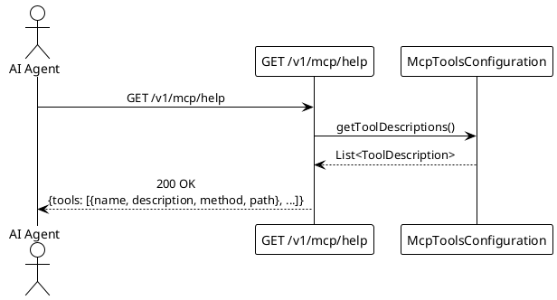

# UC004: Discover Available MCP Tools

<!--
For the AI coding assistant:
- The BDD scenarios in specs/features/ are the authoritative behaviour specification.
- Implement exactly what the scenarios describe — no more, no less.
- Use only terms defined in specs/glossary.md.
-->

## Overview

| Property              | Value                                                                                      |
| --------------------- | ------------------------------------------------------------------------------------------ |
| **ID**                | UC004                                                                                      |
| **Level**             | User Goal                                                                                  |
| **Primary Actor**     | AI Agent                                                                                   |
| **Trigger**           | AI Agent requests a tool directory at the start of a session                               |
| **Precondition**      | MCP server is running and healthy                                                          |
| **Success Guarantee** | AI Agent receives a complete, accurate list of all available MCP tools                    |
| **Related Rules**     | —                                                                                          |
| **Related Feature**   | [features/UC004-discover-mcp-tools.feature](../features/UC004-discover-mcp-tools.feature) |

## Goal

Allow an AI Agent to programmatically discover what tools the MCP server exposes, including
each tool's name, natural-language description, HTTP method, and path. This enables the
agent to plan its interaction sequence without hard-coded knowledge of the server's
capabilities.

This use case is read-only. It does **not** invoke any other tool or modify any data.

## Main Success Scenario

1. **AI Agent** sends `GET /v1/mcp/help`.
2. **System** assembles the list of registered MCP tools from the configuration.
3. **System** responds with HTTP 200 and a `HelpInfo` JSON object containing a `tools` array.
4. **AI Agent** reads the tool list and uses it to plan subsequent interactions (e.g., calling
   UC001 before UC002).

## Extensions (Alternate Flows)

**2a. Server error during assembly:**

1. System responds with HTTP 500 and error code `INTERNAL_ERROR`.
2. Use case ends in failure.

## Transaction Boundary

Read-only. No database interaction. Tool metadata is held in memory by the application
context and does not require a transaction.

## Sequence Diagram

## BDD Scenarios

The feature file is the **single source of truth** for behaviour — it is also executed as an
acceptance test. See [features/UC004-discover-mcp-tools.feature](../features/UC004-discover-mcp-tools.feature).

| Scenario ID | Description |
| ----------- | ----------- |
| UC004-S01   | Help response lists all four expected MCP tools |
| UC004-S02   | Each tool entry contains name, description, method, and path |
